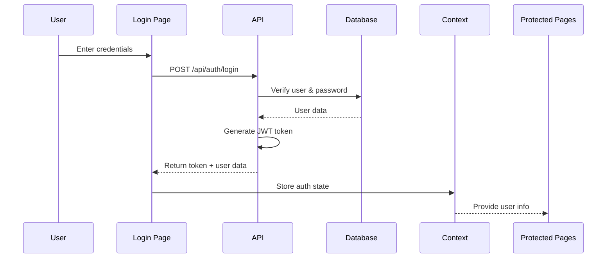

# Authentication & Authorization

Complete guide to the authentication system, user roles, and permissions.

## Overview

The system uses **JWT-based authentication** with role-based access control (RBAC) supporting three user roles: Admin, Manager, and Member.

## User Roles

### 👑 Admin

**Full system access** including user management.

**Permissions**:

- ✅ View all resources
- ✅ Create/edit/delete AMCs, assets, issues
- ✅ Manage users (create, update roles, deactivate)
- ✅ Access analytics and reports
- ✅ Receive email alerts for critical events

### 👔 Manager

**Resource management** without user administration.

**Permissions**:

- ✅ View all resources
- ✅ Create/edit AMCs, assets
- ✅ View and update issues
- ❌ Cannot manage users
- ❌ Cannot delete resources

### 👤 Member

**Basic access** for residents.

**Permissions**:

- ✅ View AMCs, assets
- ✅ Create and view own issues
- ✅ Receive notifications about their issues
- ❌ Cannot create/edit AMCs or assets
- ❌ Cannot manage users

## Authentication Flow



## Password Security

### Hashing Algorithm

- **Algorithm**: SHA256
- **Storage**: 64-character hex string
- **Salt**: Not implemented (consider adding for production)

### Generate Password Hash

```javascript
const crypto = require("crypto");
const hash = crypto.createHash("sha256").update("password").digest("hex");
console.log(hash);
// Output: 5e884898da28047151d0e56f8dc6292773603d0d6aabbdd62a11ef721d1542d8
```

### Updating Password Hashes

Run in Supabase SQL Editor:

```sql
-- Update user password
UPDATE users
SET password_hash = '240be518fabd2724ddb6f04eeb1da5967448d7e831c08c8fa822809f74c720a9'
WHERE email = 'admin@test.com';
-- Password: admin123
```

## JWT Tokens

### Token Structure

```json
{
  "sub": "user-uuid-here",
  "iat": 1704153600,
  "exp": 1704758400
}
```

### Token Properties

- **Encoding**: base64url (URL-safe)
- **Expiration**: 7 days
- **Storage**: localStorage (client-side)
- **Header**: `Authorization: Bearer <token>`

### Token Verification

Server-side verification in API routes:

```typescript
import { verifyToken } from "@/lib/auth/utils";

const token = req.headers.get("authorization")?.split(" ")[1];
const payload = verifyToken(token);
const userId = payload.sub;
```

## API Endpoints

### POST /api/auth/login

Login with email and password.

**Request**:

```json
{
  "email": "admin@test.com",
  "password": "admin123"
}
```

**Response**:

```json
{
  "token": "eyJhbGc...",
  "user": {
    "id": "uuid",
    "email": "admin@test.com",
    "full_name": "Admin User",
    "role": "admin",
    "society_id": "society-uuid",
    "is_active": true
  }
}
```

### POST /api/auth/signup

Create new user account.

**Request**:

```json
{
  "email": "user@example.com",
  "password": "securepass123",
  "full_name": "John Doe",
  "phone": "+1234567890",
  "society_id": "society-uuid"
}
```

**Response**:

```json
{
  "token": "eyJhbGc...",
  "user": {
    /* user object */
  }
}
```

### GET /api/auth/me

Get current authenticated user.

**Headers**: `Authorization: Bearer <token>`

**Response**:

```json
{
  "id": "uuid",
  "email": "admin@test.com",
  "role": "admin"
  /* ... */
}
```

### PUT /api/auth/update-role

Update user role (Admin only).

**Request**:

```json
{
  "userId": "target-user-uuid",
  "role": "manager"
}
```

## Protected Routes

### Client-Side Protection

```tsx
import { useAuth } from "@/lib/auth/context";

export default function ProtectedPage() {
  const { user, loading } = useAuth();

  if (loading) return <div>Loading...</div>;
  if (!user) {
    redirect("/auth/login");
  }

  return <div>Protected Content</div>;
}
```

### Role-Based UI

```tsx
import { useAuth } from "@/lib/auth/context";
import { canManageUsers } from "@/lib/auth/permissions";

export default function AdminPanel() {
  const { user } = useAuth();

  if (!canManageUsers(user?.role)) {
    return <div>Access Denied</div>;
  }

  return <div>Admin Panel</div>;
}
```

## Database Schema

### Users Table

```sql
CREATE TABLE users (
  id UUID PRIMARY KEY DEFAULT uuid_generate_v4(),
  email VARCHAR(255) UNIQUE NOT NULL,
  password_hash VARCHAR(255) NOT NULL,
  full_name VARCHAR(255),
  phone VARCHAR(20),
  role VARCHAR(20) DEFAULT 'member',
  society_id UUID REFERENCES societies(id),
  is_active BOOLEAN DEFAULT true,
  last_login TIMESTAMP,
  created_at TIMESTAMP DEFAULT CURRENT_TIMESTAMP,
  updated_at TIMESTAMP DEFAULT CURRENT_TIMESTAMP
);
```

## Test Accounts

Default test accounts (created by `setup-society.js`):

| Email            | Password   | Role    |
| ---------------- | ---------- | ------- |
| admin@test.com   | admin123   | admin   |
| manager@test.com | manager123 | manager |
| member@test.com  | member123  | member  |

⚠️ **Security Note**: Change these passwords before production deployment!

## Security Best Practices

1. **Password Requirements**

   - Minimum 8 characters
   - Consider adding complexity requirements
   - Implement password reset functionality

2. **Token Management**

   - Tokens expire after 7 days
   - Store securely in httpOnly cookies (recommended for production)
   - Clear token on logout

3. **API Security**

   - Always verify JWT on server-side
   - Check user permissions for each action
   - Use HTTPS in production

4. **Database Security**
   - Enable Supabase Row Level Security (RLS)
   - Never expose service role key to client
   - Audit user actions

## Next Steps

- [Configure environment variables](configuration)
- [Explore API endpoints](api-reference)
- [Set up email notifications](email-setup)

---

[← Quick Start](quick-start) | [Next: API Reference →](api-reference)
